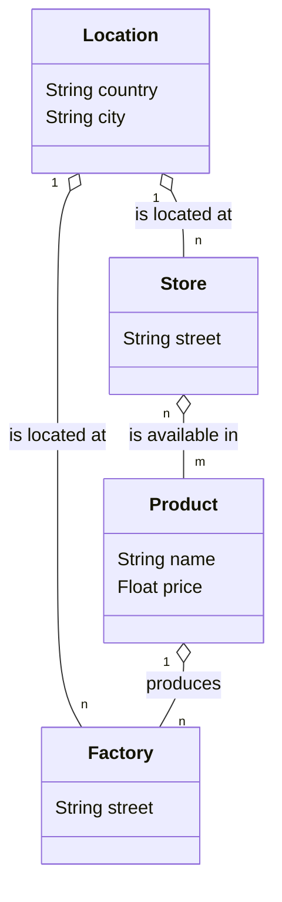

# Class/UML diagram
Topic: Database, Django models, Design  
Difficulty: :star: :star: :star: 

## Class/UML diagram to django models
Let's start with a given UML diagram, shown below. It has four tables and every table as some basic columns.

### Exercises

* Write the **django** models, which implement the diagram
* Is there any optimization, which could be done?