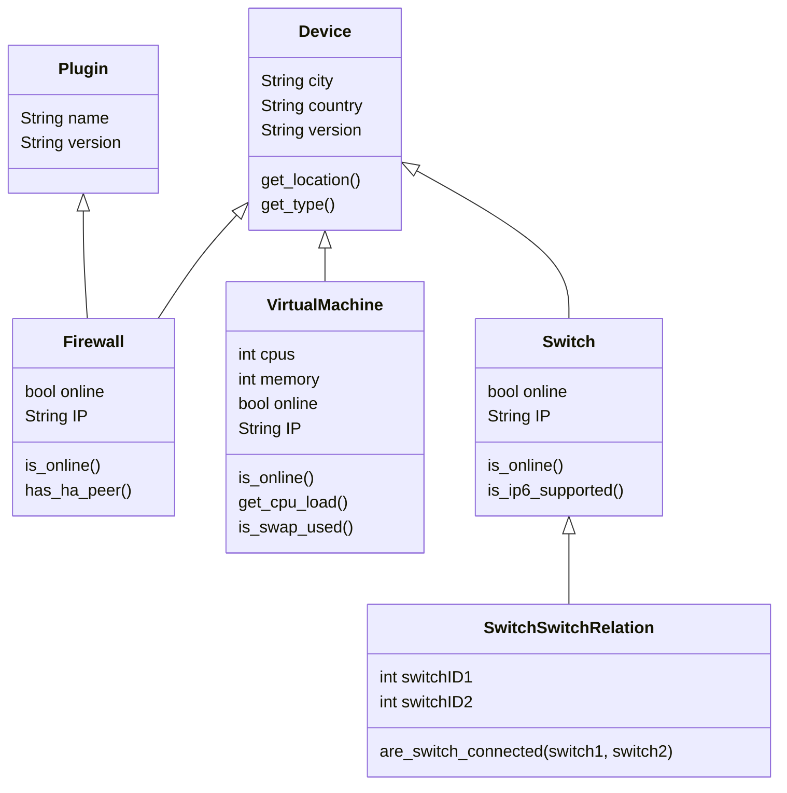

# Foreign relations

## Basic

```python
# models.py

from django.db import models


class Category(models.Model):
    name = models.CharField(max_length=20, help_text="Name of the category")
    

class Product(models.Model):
    name = models.CharField(max_length=100, help_text="Name of the product")
    catalog_identification = models.CharField(
        max_length=8, 
        unique=True, 
        help_text="Unique identification in the catalog"
    )
    
    price = models.FloatField(help_text="Price of the product in euro")

    category = models.ForeignKey(
        Category, 
        on_delete=models.SET_NULL, 
        null=True, 
        help_text="The category of the product, if known"
    )
```

### Exercises

* Give a reason, why it makes sense to use a **Category** model instead of having the category name inside the product?
* *category* in **Product** is a just a helper property, what is the underlying field name (what would be in the database column)?
* What is the relation between **Product** and **Category**?
* *category* is nullable and has *on_delete* set to *models.SET_NULL*.
  * What does *null=True* mean and what are the implications, if a new **Product** is created?
  * When is the time, that *on_delete=models.SET_NULL* is relevant and what happens then to *category* in **Product**?
  * Can *null=True* work without **on_delete=models.SET_NULL* or vise versa?
  * What are other options for *on_delete* and when you would use them?


## Normalisate models/database
Next we have a class/UML diagram, which describes the database tables/models and some
methods of them. 



### Exercise
* Write the corresponding **Django** models (everything can be in a single file)
* The diagram is not correct at all points, correct the relations
* From a relational database (ex. SQL databases) this class/UML diagram violates the normalisation principle. Normalise the diagramm
* Update the previous code (or create new one )
* What are the advantages of the normalisation?