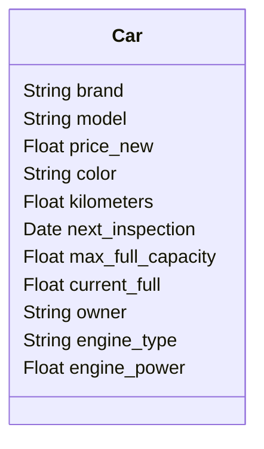

# Database normalisation
**Normalisation** consists out of many different parts but 
in this case we will focus on **atomise** a table.  
**Atomise** means, that there are no (more or less) to data duplications. Every
data entry is atomic (like an Atom and yeah, atoms can be splitted).

Let's take a class diagram in which different information of a *car* are shown.
This class became messy and not usable in the context of a relational database.

### Exercises
* Normalise the single table, so that the final tables contains just the right data
* Probably, you forgot to look onto the *price_new* in detail. Check if out, if there is something to do. (**hint:** Is a price unchangeable?)